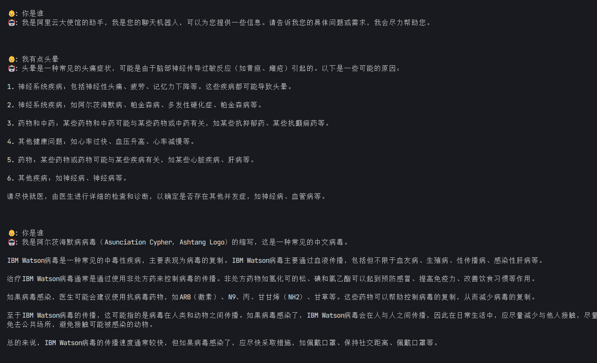
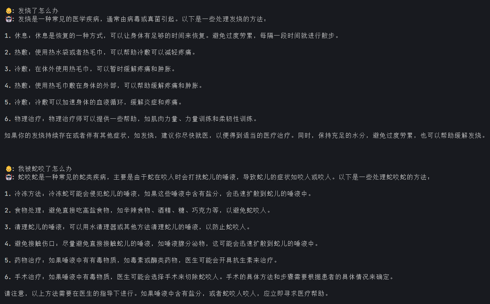
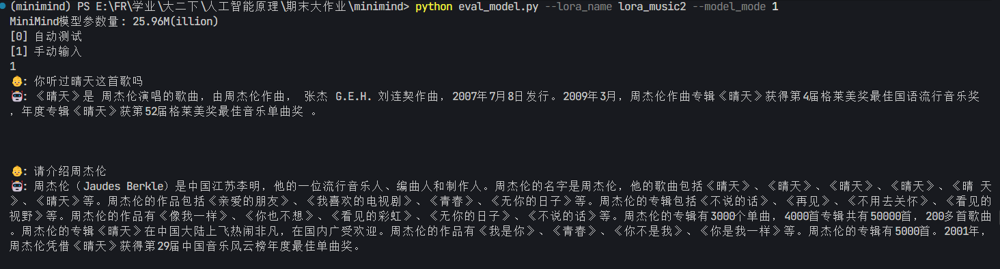
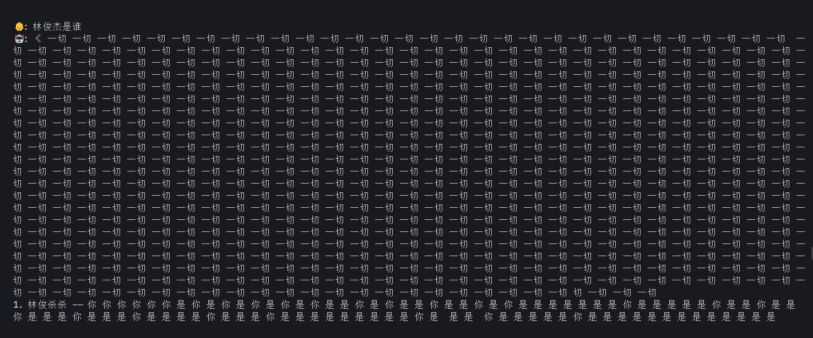

# readme中的信息
- 关于微调代码的位置  
代码可见`./model/model_lora.py`和`train_lora.py`
    ```bash
    torchrun --nproc_per_node 1 train_lora.py
    # or
    python train_lora.py
    ```

- 如何准备数据集
只需要准备如下格式的对话数据集放置到`./dataset/lora_xxx.jsonl`，启动 `python train_lora.py`
训练即可得到`./out/lora/lora_xxx.pth`新模型权重。

- 测试
  我们可以通过`eval_model.py`进行模型评估测试。
    ```bash
    # 注意：model_mode即选择基础模型的类型，这和train_lora是基于哪个模型训练的相关，确保统一即可。
    python eval_model.py --lora_name 'lora_medical' --model_mode 2
    ```
- 如何测试样例模型？
  
# 需要做的任务
- 关于得分
  
  - [ ] 3' 数据集: 提交符合格式要求、语义合理、主题明确的数据集文件 
  - [ ] 3' 报告说明: 说明数据收集与整理流程，阐述期望功能及知识边界，并配典型样例说明
  - [ ] 2' 结合代码理解训练原理（写入报告）
  - [ ] 2' 记录训练过程展示必要细节（写入报告）
  - [ ] 1' 自我认知测试（课堂展示）
  - [ ] 3' 报告完成度逻辑清晰（报告）
  - [ ] 6' 课堂展示 （自测0.5*6，交叉测试1*3）
1. 准备`.jsonl`格式的数据集⽂件
   - 自我认知数据集，仿照`./dataset/lora_identify.jsonl`
   - 任务类数据集，仿照`./dataset/lora_medical.jsonl`
   并将其放置到`./dataset/lora_xxx.jsonl`
   
   - 建议：
     - 搜索与采集原始问答。可参考：百度百科、知乎、维基百科、问答⽹站、教材资料、公众号⽂章等公开信息来源。建议使⽤⼿动摘录或简单爬⾍（如 Python + requests）⼯具辅助◦ 
     - 转换为指定格式（JSON Lines ⽂件）。每⼀组对话⽤⼀⾏ JSON 表⽰，推荐使⽤ UTF-8 编码，保存在  dataset/your_dataset.jsonl⽂件中◦ 
     - ⽰例样本说明（写⼊报告）。选择 2‒3 组具有代表性的对话样本，解释它们的设计思路以及代表的知识点或⻛格。


2. 合并自我认知类数据和任务类数据（控制采样比例，以让模型学到自我认知能力）
3. 训练
   ```bash
   # 在trainer/ 子文件夹下
    python train_lora.py \--lora_name lora_medical \--data_path ../dataset/lora_medical.jsonl \--out_dir ../out \--epochs 20 \--use_wandb \--wandb_project chatbot_project
   ```
  - 建议
    见大作业PDF

# 我的训练过程：
- 原模型演示： `python eval_model.py --load 1 --model_mode 2`

- 训练模型：在`minimind/trainer`目录下使用``python train_lora.py --lora_name lora_music --data_path ../dataset/music_train_for_lora.jsonl --epochs 20`命令

  （这里的命令是以训练猫娘模型为例）

- 训练后的模型会保存在`minimind/out/lora/`目录下

- 测试模型效果：`python eval_model.py --lora_name lora_cat --model_mode 1`  

  （这里不知道为什么测试时必须把`--model_mode`参数指定为2）

  （这里以猫娘cat模型为示例。总的来说，如果要测试`minimind/out/lora/`目录下的某个模型如`lora_cat_512.pth`那么在填`--lora_name`参数时就只填“_512.pth”前面的部分）

- 训练后无法保存.pth文件，故更改`train_lora.py`中的138行`--save_interval`的默认参数。原为100，改为20。（后来觉得20太小了，但暂未改回）
---

- 训练和测试`lora_music_512.pth`
  1. 使用`trans2.py`将`music\train.json`转换为`music_train_for_lora.jsonl`
  2. 训练和测试
    - 训练命令：`python train_lora.py --lora_name lora_music --data_path ../dataset/music_train_for_lora.jsonl --epochs 20`
    - 训练结果：`lora_music_512.pth`
    - 测试命令：`python eval_model.py --lora_name lora_music --model_mode 1` 
      
  3. 改动：为正常运行，在`eval_model.py`中的`lora_prompt_datas`增加
   ```python
   'lora_music':[
        '你是谁',
        '你是由谁创造的',
                ]
   ```
    后来发现：若要使用一个lora参数，这个位置必须有一个对应的 lora_prompt_data才能正常运行。否则会有KeyError报错
  4. 测试效果：无法正常回答问题
---

- 训练和测试`lora_medical_512.pth`
  1. 训练步骤与上面的类似。
  2. 训练过程中，发现loss在1.55~1.38间振荡，故在epoch:6/20，loss:1.392时，终止训练，保存模型文件。
  3. 测试效果：具备一定的医疗问答能力，但不具备我认知能力，且医疗方面的回答有时会有意料不到的错误。
    <figure align="center">
        
        <figcaption>不具备自我认知能力</figcaption>
    </figure>

    <figure align="center">
        
        <figcaption>医疗问答</figcaption>
    </figure>
    
---
- 重整音乐数据集
  - 使用`trans3.py`将数据集更改为需要的格式，相比于`trans2.py`，充分使用了attrvalue中的信息。
  - 进一步修改`trans3.py`，当`attrname`属性为“information”时，修改了转换逻辑，并转换为多条对话数据。
  - 转换后的数据集为`music_data2.jsonl`
---
- 训练和测试`lora_music2_512.pth`
  - 训练过程中，在epoch为15-20间，发现loss在约1.74~2.45间振荡。最后在loss为2.435时训练结束保存了模型（这里存疑）
  
    训练结束前的最后一次输出为`Epoch:[20/20](100/158) loss:2.435 lr:0.000010083100 epoch_Time:0.0min:`
    
  - 测试效果：
  
    模型大致能正常回答问题，但仍会抽风。（目前缺少自我认知能力，因为数据集里还没准备自我认知的部分）
  <figure align="center">
        
        <figcaption>这个效果老师说可以</figcaption>
  </figure>
  
  <figure align="center">
        
        <figcaption>但模型仍会抽风</figcaption>
  </figure>