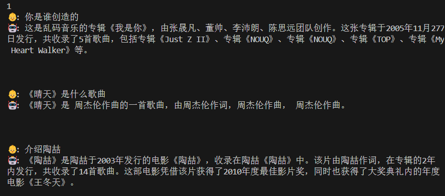

# readme中的信息
### 关于微调代码的位置  
代码可见`./model/model_lora.py`和`train_lora.py`

    ```bash
    torchrun --nproc_per_node 1 train_lora.py
    # or
    python train_lora.py
    ```

### 如何准备数据集
只需要准备如下格式的对话数据集放置到`./dataset/lora_xxx.jsonl`，启动 `python train_lora.py`
训练即可得到`./out/lora/lora_xxx.pth`新模型权重。

### 命令行问答
```bash
# load=0: load from pytorch model, load=1: load from transformers-hf model
python eval_model.py --load 1 --model_mode 2
```

### 模型评估测试
   ```bash
    # 注意：model_mode即选择基础模型的类型，这和train_lora是基于哪个模型训练的相关，确保统一即可。
    python eval_model.py --lora_name 'lora_medical' --model_mode 2
   ```

### 启动webUI

```bash
# 可能需要`python>=3.10` 安装 `pip install streamlit`
# cd scripts
streamlit run web_demo.py
```


# 需要做的任务

- 提交压缩包
  - 代码文件夹`minimind/`
  - 大作业报告.pdf
  - 数据集文件夹 `dataset/`
  - 说明文件`README.txt`
  - 运行演示视频`运行示例.mp4`

- 关于得分
  - 数据收集与标注 6' （写入大作业报告.pdf）
    - [ ] 3' 数据集: 提交符合格式要求、语义合理、主题明确的数据集文件 
    - [ ] 3' 报告说明: 定义任务目标与场景，说明数据收集与整理流程，阐述期望功能及知识边界，并配典型样例说明
  - 模型训练 8'（写入大作业报告.pdf）
    - [ ] 2' 结合代码理解训练原理
    - [ ] 2' 记录训练过程展示必要细节
    - [ ] 1' 自我认知测试（课堂展示）
    - [ ] 3' 报告完成度逻辑清晰
  - [ ] 6' 课堂展示 （自测 0.5\*6 ，交叉测试 1\*3）
  
1. 准备`.jsonl`格式的数据集⽂件
   - 自我认知数据集，仿照`./dataset/lora_identify.jsonl`
   - 任务类数据集，仿照`./dataset/lora_medical.jsonl`
   并将其放置到`./dataset/lora_xxx.jsonl`
   
   - 建议：
     - 搜索与采集原始问答。可参考：百度百科、知乎、维基百科、问答⽹站、教材资料、公众号⽂章等公开信息来源。建议使⽤⼿动摘录或简单爬⾍（如 Python + requests）⼯具辅助◦ 
     - 转换为指定格式（JSON Lines ⽂件）。每⼀组对话⽤⼀⾏ JSON 表⽰，推荐使⽤ UTF-8 编码，保存在  dataset/your_dataset.jsonl⽂件中◦ 
     - ⽰例样本说明（写⼊报告）。选择 2‒3 组具有代表性的对话样本，解释它们的设计思路以及代表的知识点或⻛格。

2. 合并自我认知类数据和任务类数据（控制采样比例，以让模型学到自我认知能力）
   
3. 训练
   ```bash
   # 在trainer/ 子文件夹下
    python train_lora.py \--lora_name lora_medical \--data_path ../dataset/lora_medical.jsonl \--out_dir ../out \--epochs 20 \--use_wandb \--wandb_project chatbot_project
   ```
  - 建议
    见大作业PDF

# 训练历程：

## 如何训练和测试

- 原模型演示： `python eval_model.py --load 1 --model_mode 2`

- 训练模型：在`minimind/trainer`目录下执行`python train_lora.py --lora_name lora_music --data_path ../dataset/music_train_for_lora.jsonl --epochs 20`命令

  （这里的命令是以训练音乐模型为例）

- 训练后的模型会保存在`minimind/out/lora/`目录下

- 测试模型效果：`python eval_model.py --lora_name lora_music --model_mode 1`  

  （这里不知道为什么测试时必须把`--model_mode`参数指定为1）

  （这里以music1模型为示例。总的来说，如果要测试`minimind/out/lora/`目录下的某个模型（如`lora_music_512.pth`），那么在填`--lora_name`参数时就只填“_512.pth”前面的部分，即`lora_music`）

- 初版文件在训练后无法保存.pth文件，故更改`train_lora.py`中的138行`--save_interval`的默认参数。原为100，改为20。（后来觉得20太小了，但暂未改回）
---
## 训练1 -- lora_music_512.pth
- 训练和测试`lora_music_512.pth`
  1. 使用`trans2.py`将`music\train.json`转换为`music_train_for_lora.jsonl`
  2. 训练和测试
    - 训练命令：`python train_lora.py --lora_name lora_music --data_path ../dataset/music_train_for_lora.jsonl --epochs 20`
    - 训练结果：`lora_music_512.pth`
    - 测试命令：`python eval_model.py --lora_name lora_music --model_mode 1` 
      
  3. 改动：为正常运行，在`eval_model.py`中的`lora_prompt_datas`增加
   ```python
   'lora_music':[
        '你是谁',
        '你是由谁创造的',
                ]
   ```
    后来发现：若要使用一个lora参数，这个位置必须有一个对应的 lora_prompt_data才能正常运行。否则会有KeyError报错
  4. 测试效果：无法正常回答问题
---

## 训练2 -- lora_medical_512.pth

- 训练和测试`lora_medical_512.pth`
  1. 训练步骤与上面的类似。
  2. 训练过程中，发现loss在1.55~1.38间振荡，故在epoch:6/20，loss:1.392时，终止训练，保存模型文件。
  3. 测试效果：具备一定的医疗问答能力，但不具备我认知能力，且医疗方面的回答有时会有意料不到的错误。
    <figure align="center">
        
        <figcaption>不具备自我认知能力</figcaption>
    </figure>

    <figure align="center">
        
        <figcaption>医疗问答</figcaption>
    </figure>
    
---

## 改进数据集 music_data2.jsonl

- 重整音乐数据集
  - 使用`trans3.py`将数据集更改为需要的格式，相比于`trans2.py`，充分使用了attrvalue中的信息。
  - 进一步修改`trans3.py`，当`attrname`属性为“information”时，修改了转换逻辑，并转换为多条对话数据。
  - 转换后的数据集为`music_data2.jsonl`
---

## 训练3 -- lora_music2_512.pth
- 训练和测试`lora_music2_512.pth`
  - 训练过程中，在epoch为15-20间时，发现loss在约1.74~2.45间振荡。最后在loss为2.435时训练结束保存了模型（这里存疑）
  
    训练结束前的最后一次输出为`Epoch:[20/20](100/158) loss:2.435 lr:0.000010083100 epoch_Time:0.0min:`
    
  - 测试效果：
  
    模型大致能正常回答问题，但仍会抽风。（目前缺少自我认知能力，因为数据集里还没准备自我认知的部分）
  <figure align="center">
        
        <figcaption>这个效果老师说可以</figcaption>
  </figure>
  
  <figure align="center">
        
        <figcaption>但模型仍会抽风</figcaption>
  </figure>
---
## 整理数据集（6.8zsf）
- 将`music_data2`与`identity_data`合并（其中identity_data数据重复2次）
---
## 训练4 -- lora_music3_512.pth（6.8zsf）
- 训练`lora_music3_512.pth`
  - 训练命令`python train_lora.py --lora_name lora_music3 --data_path ../dataset/music_data3.jsonl --epochs 20`          
  
  - 记录loss：
```python
[2.739, 2.994, 2.316, 2.673, 2.892, 2.031, 2.508, 2.817, 1.880, 2.378, 2.753, 1.782, 2.275, 2.700, 1.711, 2.189, 2.657, 1.657, 2.118, 2.622, 1.614, 2.058, 2.592, 1.578, 2.007, 2.568, 1.549, 1.964, 2.547, 1.525, 1.928, 2.530, 1.505, 1.896, 2.515, 1.489, 1.869, 2.503, 1.476, 1.846, 2.494, 1.465, 1.827, 2.486, 1.456, 1.811, 2.480, 1.449, 1.798, 2.474, 1.443, 1.788, 2.470, 1.439, 1.781, 2.467, 1.435, 1.776, 2.464, 1.432]
```
  - 测试模型`python eval_model.py --lora_name lora_music3 --model_mode 1`
  
  - 好消息，模型自我认知不错，但是回答音乐问题很难绷（如下图）
  <figure align="center">
        
        <figcaption>自我认知还可以</figcaption>
  </figure>

  <figure align="center">
        
        <figcaption>回答问题绷不住了</figcaption>
  </figure>

## 训练5 -- lora_music4_512.pth（6.13zsf）
- 改进：
  - 使用shuffle.py将music_data3.jsonl数据打乱，并将训练轮数减少为10轮
- 训练：
  - 训练命令：`python train_lora.py --lora_name lora_music4 --data_path ../dataset/music_data3_shuffled.jsonl --epochs 10`
  - 记录loss：
  ```python
  loss_values = [
    2.958, 2.661, 2.345,  # Epoch 1
    2.631, 2.317, 2.273,  # Epoch 2
    2.402, 2.358, 2.387,  # Epoch 3
    2.150, 2.297, 1.934,  # Epoch 4
    2.211, 1.891, 2.119,  # Epoch 5
    1.933, 2.223, 1.920,  # Epoch 6
    2.040, 2.077, 1.925,  # Epoch 7
    1.993, 1.868, 1.960,  # Epoch 8
    2.095, 2.000, 2.174,  # Epoch 9
    1.968, 2.099, 2.039   # Epoch 10
  ]
  ```
- 测试：
  - 测试命令：`python eval_model.py --lora_name lora_music4 --model_mode 1`
  - 结果：
  模型仍会抽风
  <figure align="center">
        
        <figcaption>仍会抽风</figcaption>
  </figure>

## 训练6 -- lora_music5_512.pth（6.13zsf）
- 尝试：在上一轮的基础上，降低训练轮数，由10轮降为5轮
- 训练命令：`python train_lora.py --lora_name lora_music5 --data_path ../dataset/music_data3_shuffled.jsonl --epochs 5 `
- 记录loss
```python
loss_values = [
    2.958, 2.662, 2.348,  # Epoch 1
    2.636, 2.327, 2.293,  # Epoch 2
    2.424, 2.388, 2.431,  # Epoch 3
    2.197, 2.365, 2.012,  # Epoch 4
    2.288, 2.004, 2.245   # Epoch 5
]
```
- 结果：比music4好了一点。自我认知变强，抽风概率小了，但问到音乐相关问题时仍可能抽风，并大概率回答不准确
  <figure align="center">
        
        <figcaption>自我认知好了一些</figcaption>
  </figure>

## 训练7 -- lora_music5_512.pth（6.13zsf）
- 尝试：在上一轮的基础上，降低学习率，由1e-4降为1e-5
- 训练命令：`python train_lora.py --lora_name lora_music6 --data_path ../dataset/music_data3_shuffled.jsonl --epochs 5 --learning_rate 1e-5 `
- 结果：变差。连基本的自我认知也没学到

## 训练8
- 改进：重整了数据集`music_data4.jsonl`，删除原数据集中的零碎信息
- 训练命令：`python train_lora.py --lora_name lora_music7 --data_path ../dataset/music_data4_shuffled.jsonl --epochs 5`
- loss：
  ```python
  loss_values = [
    # Epoch 1
    2.826, 2.788, 2.534, 2.522,
    # Epoch 2
    2.606, 2.349, 2.527, 2.073,
    # Epoch 3
    2.350, 2.267, 2.148, 2.045,
    # Epoch 4
    2.019, 2.308, 2.151, 2.342,
    # Epoch 5
    2.187, 2.120, 2.102, 1.971
  ]
  ```
- 效果：自我认知效果改进，回答问题不准的问题未改进，可能一直重复的问题未修复

## 训练9
- 改进：改进了自我认知数据集，将新的自我认知数据集加入`music_data4_1.jsonl`
- 训练命令：`python train_lora.py --lora_name lora_music8 --data_path ../dataset/music_data4_1_shuffled.jsonl --epochs 5`
- 效果：未有明显改进。效果似乎不如 music7

## 训练10
- 改进：鉴于训练9的loss在第三轮时已经收敛，故调整至只训练3轮
- 训练命令：`python train_lora.py --lora_name lora_music9 --data_path ../dataset/music_data4_1_shuffled.jsonl --epochs 3`
- 效果：相对于 music8，无明显改进

## 数据集music_data5
- 仅保留了周王林陶
- 15 * raw + 4 * id 的数据量